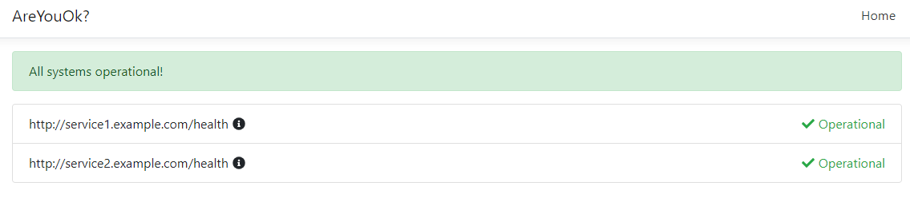

# AreYouOk
A health polling service with a status page for your application.

Will poll endpoints and look for a successfull status code 2xx.



## Installation

`docker pull martinfylke/areyouok`

### Database
This application does not host, nor will create a database for you.
You'll have to create the actual database, while the application handles the migrations and the data in the database.

When you have created the database you can add the connection string to the environment variables. More on the environment variables below.

The application supports MSSQL, MongoDB and PostgreSQL. If any other Database providers are wanted, add an issue or do a PR.

### Environment variables
| Env. variable | Explanation | Example value |
|---|---|---|
|ASPNETCORE_ENVIRONMENT|The environment setting for the application|"Production"/"Development"|
|HEALTH_POLL_RATE_SECONDS| The rate at which you want to poll the health endpoint, in seconds| "60"|
|DB_PROVIDER|The database provider| "mssql"/"postgres"/"mongodb"|
|DB_CONNECTION_STRING| The connection string to your database.| "http://localhost:2017/areyouok"|
|HEALTH_ENDPOINTS| The health endpoints that you want to poll. Separated by space. | "http://service1.example.com/health http://service2.example.com/health" |
|DATA_RETENTION_DAYS| The number of days you want to keep your poll logs. | "30"|

There is a very slim yaml file which you can use to get going. Looks like this:

```yaml
apiVersion: apps/v1
kind: Deployment
metadata:
  name: areyouok
spec:
  replicas: 1
  selector:
    matchLabels:
      app: areyouok
  template:
    metadata:
      labels:
        app: areyouok
    spec:
      containers:
      - name: areyouok
        image: martinfylke/areyouok:latest
        ports:
          - containerPort: 80
        env:
        - name: ASPNETCORE_ENVIRONMENT
          value: "Production"
        - name: HEALTH_POLL_RATE_SECONDS
          value: "60"
        - name: DB_PROVIDER
          value: "mongodb"
        - name: DB_CONNECTION_STRING
          value: "mongodb://localhost:27017/areyouok"
        - name: HEALTH_ENDPOINTS
          value: "{YourEndpoint1} {YourEndpoint2} {YourEndpoint3}"
        - name: DATA_RETENTION_DAYS
          value: "30"
---
apiVersion: v1
kind: Service
metadata:
  name: areyouok
spec:
  ports:
  - port: 30010
    protocol: TCP
    targetPort: 80
  selector:
    app: areyouok
  type: LoadBalancer
```
